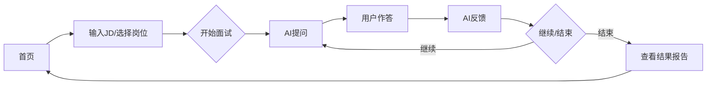

## 1. Product Overview
AI 面试「陪练官」是一款基于 AI 的网页端面试模拟应用，帮助求职者进行针对性的面试训练，获得实时反馈和能力评估，大幅提升面试成功率。

## 2. Core Features

### 2.1 User Roles
| Role | Registration Method | Core Permissions |
|------|---------------------|------------------|
| User | No registration required | Use all interview practice features |

### 2.2 Feature Module
1. **首页**: 产品介绍、开始练习入口、热门岗位推荐
2. **JD 输入页**: 输入目标岗位描述，选择行业和岗位类型
3. **面试模拟页**: AI 面试官多轮对话、用户作答输入、实时反馈展示
4. **结果分析页**: 能力雷达图、优化建议、面试记录

### 2.3 Page Details
| Page Name | Module Name | Feature description |
|-----------|-------------|---------------------|
| 首页 | Hero Section | 产品核心价值展示，醒目的"开始练习"按钮 |
| 首页 | 热门岗位 | 展示常用岗位快速选择卡片 |
| JD 输入页 | JD 输入区 | 文本输入框，支持粘贴 JD 内容 |
| JD 输入页 | 岗位选择 | 行业和岗位类型下拉选择 |
| 面试模拟页 | 对话区 | 展示面试官提问和用户回答历史 |
| 面试模拟页 | 输入区 | 用户作答输入框，支持实时打字效果 |
| 面试模拟页 | 反馈区 | AI 实时点评和优化建议 |
| 结果分析页 | 雷达图 | 六维能力评估可视化 |
| 结果分析页 | 详细报告 | 各维度得分和改进建议 |

## 3. Core Process

## 4. User Interface Design

### 4.1 Design Style
- **主色调**: 深蓝色 (#1e3a5f) - 专业、信任
- **辅助色**: 翠绿色 (#00d4aa) - 积极、成长
- **按钮风格**: 圆角矩形，渐变背景，hover 放大效果
- **字体**: Inter + JetBrains Mono 组合，现代专业感
- **布局**: 卡片式设计，左侧导航，右侧主内容区
- **动效**: 平滑过渡、打字机效果、进度动画

### 4.2 Page Design Overview
| Page Name | Module Name | UI Elements |
|-----------|-------------|-------------|
| 首页 | Hero | 大标题、副标题、CTA按钮、背景渐变动画 |
| 首页 | Features | 三列卡片展示核心功能点 |
| 面试页 | Chat Area | 气泡式对话，面试官气泡偏左，用户气泡偏右 |
| 面试页 | Input | 底部固定输入框，支持回车键发送 |
| 结果页 | Radar Chart | 六边形雷达图，动态绘制动画 |

### 4.3 Responsiveness
- Desktop-first 设计
- Tablet: 两栏布局自适应
- Mobile: 单列堆叠，隐藏侧边栏
