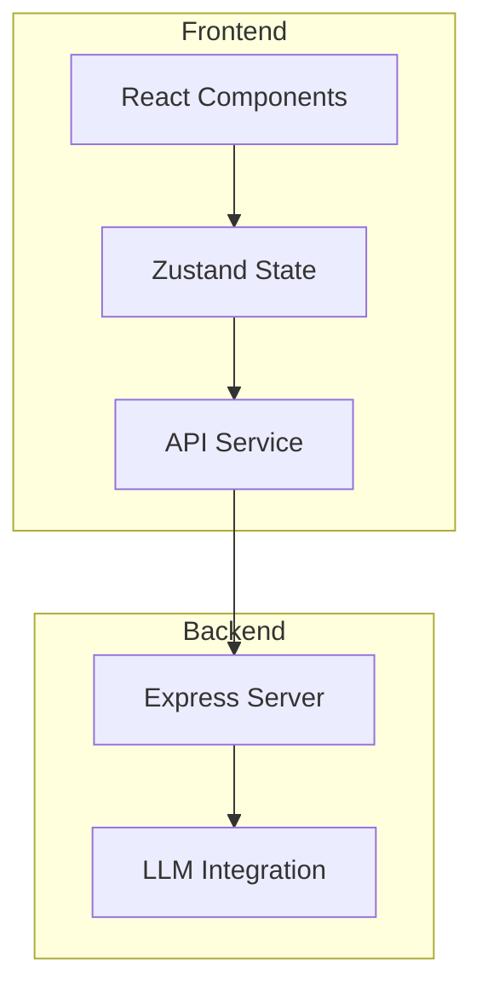

## 1. Architecture Design



## 2. Technology Description
- Frontend: React@18 + TypeScript + TailwindCSS@3 + Vite
- State Management: Zustand
- Charts: Recharts
- Icons: Lucide React
- Backend: Express@4 + TypeScript
- LLM: Mock API (内置模拟数据)

## 3. Route Definitions
| Route | Purpose |
|-------|---------|
| / | 首页，产品介绍和入口 |
| /interview | 面试模拟主页面 |
| /results | 面试结果分析页 |

## 4. API Definitions

### 4.1 /api/interview/start
**POST** - 开始新的面试

Request body:
```typescript
{
  jd: string;
  industry: string;
  position: string;
}
```

Response:
```typescript
{
  success: boolean;
  question: string;
  interviewId: string;
}
```

### 4.2 /api/interview/answer
**POST** - 提交回答并获取反馈

Request body:
```typescript
{
  interviewId: string;
  answer: string;
}
```

Response:
```typescript
{
  success: boolean;
  feedback: {
    rating: number;
    comment: string;
    optimizedAnswer: string;
    strengths: string[];
    weaknesses: string[];
  };
  nextQuestion: string | null;
}
```

### 4.3 /api/interview/results
**GET** - 获取面试结果

Request: `GET /api/interview/results?id={interviewId}`

Response:
```typescript
{
  success: boolean;
  radarData: {
    dimension: string;
    score: number;
  }[];
  summary: string;
  suggestions: string[];
}
```

## 5. Data Model

### Interview Session
```typescript
interface InterviewSession {
  id: string;
  jd: string;
  industry: string;
  position: string;
  questions: Question[];
  answers: Answer[];
  createdAt: Date;
}

interface Question {
  id: string;
  content: string;
  type: 'behavioral' | 'technical' | 'situational' | 'cultural';
}

interface Answer {
  id: string;
  questionId: string;
  content: string;
  feedback: Feedback;
}

interface Feedback {
  rating: number;
  comment: string;
  optimizedAnswer: string;
  strengths: string[];
  weaknesses: string[];
}
```

## 6. Mock Data

### Mock Questions by Position
- **前端开发**: 关于 React/Vue、JavaScript、CSS、性能优化等问题
- **产品经理**: 关于需求分析、项目管理、用户研究等问题
- **数据分析师**: 关于 SQL、Python、数据可视化等问题

### Mock Feedback Engine
内置评分算法，基于回答长度、关键词匹配、结构化程度生成反馈
